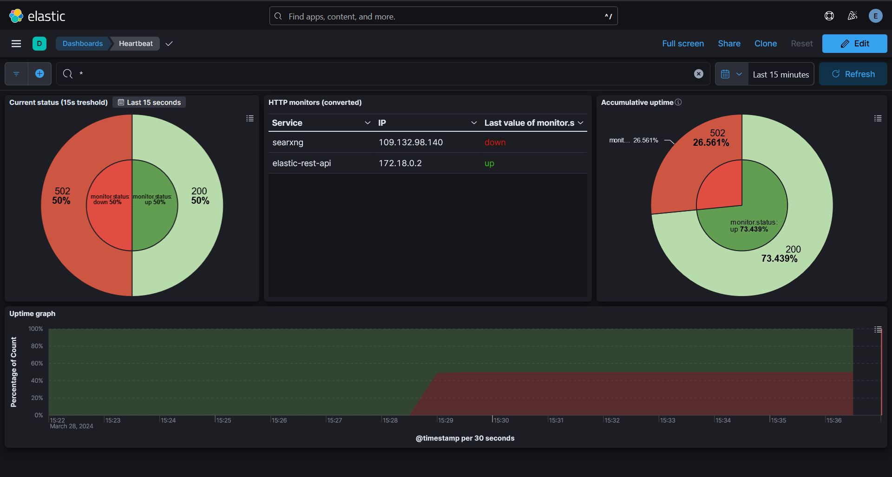

# ELK Stack integration project



## Used/interesting resources

-   [Official ELK docs](https://www.elastic.co/guide/index.html)
-   [RabbitMQ training course](https://training.cloudamqp.com/)
-   No code used but pretty interesting to read: [check them out](https://github.com/Jardelpz/events_savior?tab=readme-ov-file)
-   [Used repo 1](https://github.com/deviantony/docker-elk) setup script and also inspiration from reading their code base FOLLOW THEIR [MIT LICENSE](https://github.com/deviantony/docker-elk/blob/main/LICENSE)! or [BACKUP LINK](./LICENSE1.txt)
-   [Used repo 2](https://github.com/elastic/uptime-contrib) dashboard resources used form their 7.x dashboard FOLLOW THEIR [APACHE LICENSE](https://github.com/elastic/uptime-contrib/blob/master/LICENSE)! or [BACKUP LINK](./LICENSE2.txt)
-   [YTB NetworkChuck tutorial docker](https://www.youtube.com/watch?v=eGz9DS-aIeY)
-   [YTB NetworkChuck tutorial docker compose](https://www.youtube.com/watch?v=DM65_JyGxCo)
-   [YTB IBM message queue](https://www.youtube.com/watch?v=xErwDaOc-Gs)
-   [YTB IBM RabbitMQ](https://www.youtube.com/watch?v=7rkeORD4jSw)
-   [YTB ELK tutorial 1 part 1](https://www.youtube.com/watch?v=MB94whqmSKI) & [YTB ELK guide 1 part 2](https://www.youtube.com/watch?v=JcGIFmkg1bE)
-   [YTB ELK tutorial 2 (french)](https://www.youtube.com/watch?v=S5MyeD8ysxA)

## Tech stack

-   Docker
-   ELK (elasticsearch, logstash, kibana)
-   Heartbeat
-   RabbitMQ (WIP)
-   WIP details

<!-- old version:
to setup ELK: Setup keys via:
docker exec -it <elastic_id> bash
cd bin
elasticsearch-create-enrollment-token --scope kibana
copy paste the token into the webui

docker exec -it <kibana_id> bash
cd bin
./kibana-verification-code
copy paste the verification code into the webui -->

## Setup

Create a `.env` file based on the `.env.example` file and fill in the required fields.

To start ELK for the first time run (keep in mind the reverse proxy (if you use one, port 5601 is used for the web interface rn, feel free to unasign it if you have one) should be in a network named `cloud`):

```bash
docker compose up setup
```

Note that this should be run only once, and if you don't move the `elasticsearch/data` folder or move the volumes location this should already be good to go.

If an error occurs due to the network try running this instead:

```bash
docker compose up setup --force-recreate
```

After the setup is done you can run the ELK stack with (for the second time you will only need to run this command):

```bash
docker compose up -d
```

You may need to run the following to fix some permission issues depending on your platform:

```bash
chmod +rwx ./setup/entrypoint.sh
chmod go-w ./heartbeat/heartbeat.yml
chmod -R 777 ./elasticsearch/data/
```

Note that the last chmod recursively add all permissions to everyone, if this is set on a real server with untrusted users please change this to only give the required permissions.

<!-- deprecate
Then you need to import `export.ndjson` into `Saved Objects` and you should see the dashboard appear in kibana. (If we add the volumes into the repo this will not be needed anymore) -->
