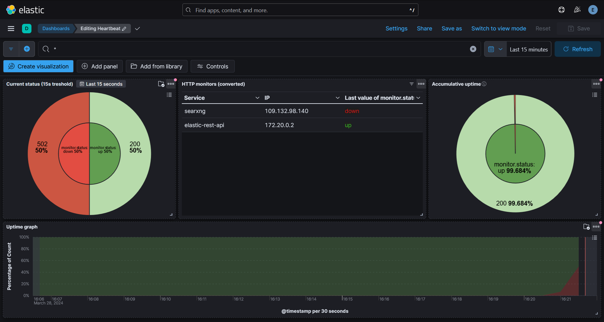

# ELK Controlroom Integration Project



## Tech stack

-   Docker
-   ELK (elasticsearch, logstash, kibana)
-   Heartbeat (http monitoring for redundancy + may help with debugging)
-   Python
-   RabbitMQ
-   Bash/Shell scripting

## Disclaimer

To run our project, we're making the assumption your on linux and have docker installed. If you're on windows, you can use wsl.

## TL;DR

### Script

Before running the script, make sure you have a RabbitMQ instance running. If this isn't running yet, you can run:

```bash
docker compose -f ./extra/rabbitmq_general_team/docker-compose.yml up -d
```

If you've already set everything up and you're just trying to run, execute the following command:

```bash
bash ./src/main.bash
```

To run and setup for the first time, run the following command:

```bash
bash ./src/main.bash setup
```

And follow the instructions.

Once you have completed the setup you will be able to access the dashboard via <http://localhost:16601/app/dashboards#/view/f3e771c0-eb19-11e6-be20-559646f8b9ba?_g=(filters:!(),refreshInterval:(pause:!f,value:1000),time:(from:now-24h%2Fh,to:now))>

After clicking the link, enter your login credentials and you'll be redirected to the monitoring dashboard. The default username is `elastic` (will be modifiable in .env), and the password is what you've entered in the `KIBANA_SYSTEM_PASSWORD` variable in your `./src/.env` file.

**Note** replace localhost with your local IP.

### Manual installation

Before running the script, make sure you have a RabbitMQ instance running. If this isn't running yet, you can run:

```bash
docker compose -f ./extra/rabbitmq_general_team/docker-compose.yml up -d
```

Go into the `./src` folder:

```bash
cd src
```

Create a `.env` file based on the `.env.example` file inside the `./src` folder and **fill in the required fields**.

```bash
cp ./.env.example ./.env
```

To start ELK for the first time run:

```bash
docker compose up setup --force-recreate
```

**Note** that this should be run only once.

After the setup is done, you can run the ELK stack with (for the second time you will only need to run this command):

```bash
docker compose up -d
```

Now you can access the dashboard via <http://localhost:16601/app/dashboards#/view/f3e771c0-eb19-11e6-be20-559646f8b9ba?_g=(filters:!(),refreshInterval:(pause:!f,value:1000),time:(from:now-24h%2Fh,to:now))>

After clicking the link, enter your login credentials and you'll be redirected to the monitoring dashboard. The default username is `elastic` (will be modifiable in .env), and the password is what you've entered in the `KIBANA_SYSTEM_PASSWORD` variable in your `./src/.env` file.

**Note** replace localhost with your local IP.

If you wish to stop the service, run the following command:

```bash
docker compose down
```

## Adding services to monitor

### Heartbeat monitoring

If you'd like to add a service to monitor, please follow these steps:

Considering you're still in the `./src` folder, run:

```bash
cd ../ELK/heartbeat/services
```

Create a `service.yml.unconfirmed` file based on the `template.yml.unconfirmed` file inside the `./ELK/heartbeat/services` folder.

```bash
cp ./template.yml.unconfirmed ./service.yml.unconfirmed
```

Once filled in correctly, modify the name accordingly (modify `service` to the actual name of the service):

```bash
mv ./service.yml.unconfirmed ./service.yml
```

**Notes**

-   We check for new yml files every 5s, consider it may take up to 10s (with both the dashboard and the service set to reload every second) before showing up.
-   While a yml file isn't configured properly, we recommend to keep the `.unconfirmed` extension.
-   If you temporarely don't want to monitor a service you can set `enabled: false` in the yml file.

#### Heartbeat configuration

We expect the services to monitor to push the following XML fot to the queue:

```xml
<xs:complexType name="heartbeat">
    <xs:all>
      <xs:element name="service" type="service"/>
      <xs:element name="timestamp" type="xs:dateTime"/>
      <xs:element name="status" type="xs:positiveInteger"/>
      <xs:element name="error" type="xs:token"/>
      <xs:element name="extra" minOccurs="0">
        <xs:complexType>
          <xs:all>
            <xs:element type="xs:positiveInteger" name="user-count" />
          </xs:all>
        </xs:complexType>
      </xs:element>
    </xs:all>
</xs:complexType>
```

## Troubleshooting

### Fixing permissions

You may need to run the following to fix some permission issues depending on your platform (in the home folder, not src folder):

```bash
chmod +rwx ./src/setup/entrypoint.sh
chmod go-w ./ELK/heartbeat/heartbeat.yml
chmod -R go-w ./ELK/heartbeat/services/
chmod -R 777 ./ELK/elasticsearch/data/
```

**Note** the last chmod recursively adds all permissions to everyone. If this is set on a real server with untrusted users, please change this to only give the required permissions.

### Reverse-proxy

If you're using a reverse proxy, keep in mind it should still be on the same network. You could create a new one and add Kibana to it if you wish to do so (if you do end up using one, port 16601 is used for the web interface, feel free to unassign it inside `./src/docker-compose.yml` if you use a reverse proxy). Inside the reverse proxy, point it towards this destination: `http://kibana:5601/`.

### First-time loading issues web UI

Whilst the service is starting up, you may have issues whilst loading the web interface, with random issues popping up that aren't related to what you're doing. To counter this, wait about a minute, then refresh your page.

**Note**

-   You may also want to check [tests][README.md#Tests], or check the container logs with `docker logs <container_id>`.
-   If you wish to access more website tips, please click [here](website_utils.md).

## Tests

### run all tests at once

If you'd like to verify everything at once, there's a few steps to follow.

You'll first need to enter `./src`. To do so, type this in your console:

```bash
cd ./src
```

After that, you'll need to run the `tests-script.bash` file. To do this, copy the following text to your CLI:

```bash
sudo bash ./tests-script.bash
```

### Run tests individually

#### docker-compose validation

In case you'd like to verify the integrity of the `docker-compose.yml` file, follow the steps below.

If you've never done a docker-compose test, please execute the following command first:

```bash
sudo apt install docker-compose
```

**Note** your packet manager may differ.

Once docker-compose is installed, please run the following command. If the file is good to go, it should return "OK". Else, it'll return "ERROR":

```bash
docker-compose config --quiet && printf "OK\n" || printf "ERROR\n"
```

#### yaml validation

First off, make sure the project is running. If it isn't running, please do so [here](README.md#Setup).

Secondly, you'll need to enter the container. To do so, there's a few steps to follow.

Get the required information of the container with the following command:

```bash
sudo docker container ls | grep heartbeat
```

Now, look for the container running heartbeat. Use the ID for the following command:

```bash
sudo docker exec -it <id> bash
```

Inside the container, you can validate the content of the yaml file with the commands written below.

To validate the content of the yaml, enter the following command:

```bash
./heartbeat test config -c ~/heartbeat.yml --path.data ~/data/ --path.home ~
```

If there are any errors and you'd like to see a more detailed explanation of what's good and wrong, use this command:

```bash
./heartbeat test output -c ~/heartbeat.yml --path.data ~/data/ --path.home ~
```

Once finished, exit the container with the following command:

```bash
exit
```

## Used ports (assigned range:16000-23999)

-   16601 (kibana, this would typically be 5601)
-   19200 (elasticsearch API, this would typically be 9200)
-   19300 (elasticsearch binary protocol, this would typically be 9300)
-   16000 (portainer, this would typically be 8000)
-   17443 (portainer https frontend, this would typically be 9443)

## Used/interesting resources

-   [Official ELK docs](https://www.elastic.co/guide/index.html)
-   [Heartbeat installation configuration](https://www.elastic.co/guide/en/beats/heartbeat/current/heartbeat-installation-configuration.html)
-   [RabbitMQ training course](https://training.cloudamqp.com/)
-   No code used but pretty interesting to read: [check them out](https://github.com/Jardelpz/events_savior?tab=readme-ov-file)
-   [Used repo 1](https://github.com/deviantony/docker-elk) setup script and also inspiration from reading their code base **FOLLOW THEIR [MIT LICENSE](https://github.com/deviantony/docker-elk/blob/main/LICENSE)!** or [BACKUP LINK](./MIT_LICENSE.txt)
-   [Used repo 2](https://github.com/elastic/uptime-contrib) dashboard resources used form their 7.x dashboard **FOLLOW THEIR [APACHE LICENSE](https://github.com/elastic/uptime-contrib/blob/master/LICENSE)!** or [BACKUP LINK](./APACHE_LICENSSE.txt)
-   [YTB NetworkChuck tutorial docker](https://www.youtube.com/watch?v=eGz9DS-aIeY)
-   [YTB NetworkChuck tutorial docker compose](https://www.youtube.com/watch?v=DM65_JyGxCo)
-   [YTB IBM message queue](https://www.youtube.com/watch?v=xErwDaOc-Gs)
-   [YTB IBM RabbitMQ](https://www.youtube.com/watch?v=7rkeORD4jSw)
-   [YTB ELK tutorial 1 part 1](https://www.youtube.com/watch?v=MB94whqmSKI) & [YTB ELK guide 1 part 2](https://www.youtube.com/watch?v=JcGIFmkg1bE)
-   [YTB ELK tutorial 2 (french)](https://www.youtube.com/watch?v=S5MyeD8ysxA)
