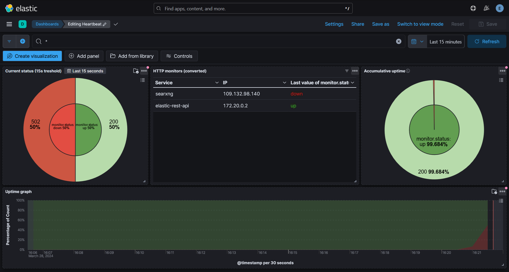

# ELK Controlroom Integration Project



## Used/interesting resources

-   [Official ELK docs](https://www.elastic.co/guide/index.html)
-   [RabbitMQ training course](https://training.cloudamqp.com/)
-   No code used but pretty interesting to read: [check them out](https://github.com/Jardelpz/events_savior?tab=readme-ov-file)
-   [Used repo 1](https://github.com/deviantony/docker-elk) setup script and also inspiration from reading their code base **FOLLOW THEIR [MIT LICENSE](https://github.com/deviantony/docker-elk/blob/main/LICENSE)!** or [BACKUP LINK](./MIT_LICENSE.txt)
-   [Used repo 2](https://github.com/elastic/uptime-contrib) dashboard resources used form their 7.x dashboard **FOLLOW THEIR [APACHE LICENSE](https://github.com/elastic/uptime-contrib/blob/master/LICENSE)!** or [BACKUP LINK](./APACHE_LICENSSE.txt)
-   [YTB NetworkChuck tutorial docker](https://www.youtube.com/watch?v=eGz9DS-aIeY)
-   [YTB NetworkChuck tutorial docker compose](https://www.youtube.com/watch?v=DM65_JyGxCo)
-   [YTB IBM message queue](https://www.youtube.com/watch?v=xErwDaOc-Gs)
-   [YTB IBM RabbitMQ](https://www.youtube.com/watch?v=7rkeORD4jSw)
-   [YTB ELK tutorial 1 part 1](https://www.youtube.com/watch?v=MB94whqmSKI) & [YTB ELK guide 1 part 2](https://www.youtube.com/watch?v=JcGIFmkg1bE)
-   [YTB ELK tutorial 2 (french)](https://www.youtube.com/watch?v=S5MyeD8ysxA)

## Tech stack

-   Docker
-   ELK (elasticsearch, logstash, kibana)
-   Heartbeat (http monitoring for redundancy + may help with debugging)
-   Python
-   RabbitMQ (WIP)

## Setup

Go into the `./src` folder:

```bash
cd src
```

Create a `.env` file based on the `.env.example` file inside the `./src` folder and **fill in the required fields**.

```bash
cp ./.env.example ./.env
```

To start ELK for the first time run (keep in mind the reverse proxy should be in the same network (you could create a new one and add kibana to it) (if you use one, port 5601 is standard used for the web interface, feel free to unasign it inside `./src/docker-compose.yml` if you use a reverse proxy)):

```bash
docker compose up setup
```

**Note** that this should be run only once.

If an error occurs due to the network try running this instead:

```bash
docker compose up setup --force-recreate
```

After the setup is done you can run the ELK stack with (for the second time you will only need to run this command):

```bash
docker compose up -d
```

## Troubleshooting

You may need to run the following to fix some permission issues depending on your platform (in the home folder not src):

```bash
chmod +rwx ./src/setup/entrypoint.sh
chmod go-w ./ELK/heartbeat/heartbeat.yml
chmod -R 777 ./ELK/elasticsearch/data/
```

**Note** that the last chmod recursively add all permissions to everyone, if this is set on a real server with untrusted users please change this to only give the required permissions.

## Adding services to monitor
### Heartbeat monitoring

If you'd like to add a service to monitor, please follow these steps:

Considering you're in the `./src` folder, run:
```bash
cd ../ELK/heartbeat/services
```

Create a `service.yml.unconfirmed` file based on the `template.yml.unconfirmed` file inside the `./ELK/heartbeat/services` folder.

```bash
cp ./template.yml.unconfirmed ./service.yml.unconfirmed
```

Now **fill in the required fields**.

Once filled in correctly, modify the name accordingly (modify the name of the service to the actual service):
```bash
mv ./service.yml.unconfirmed ./service.yml
```


<!-- deprecate as we have set the volume in the repo
Then you need to import `export.ndjson` into `Saved Objects` and you should see the dashboard appear in kibana. (If we add the volumes into the repo this will not be needed anymore) -->

<!-- old version:
to setup ELK: Setup keys via:
docker exec -it <elastic_id> bash
cd bin
elasticsearch-create-enrollment-token --scope kibana
copy paste the token into the webui

docker exec -it <kibana_id> bash
cd bin
./kibana-verification-code
copy paste the verification code into the webui -->
