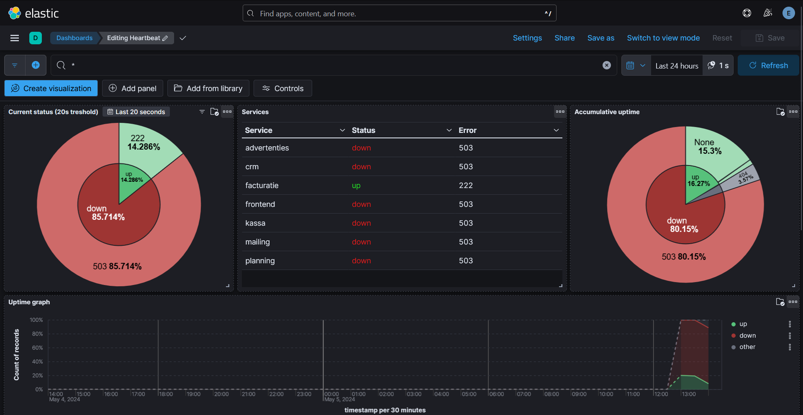
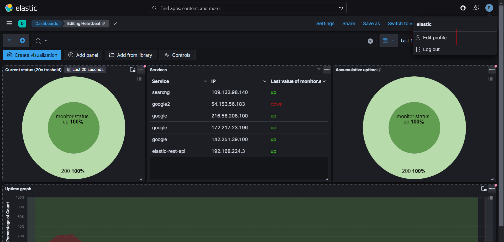
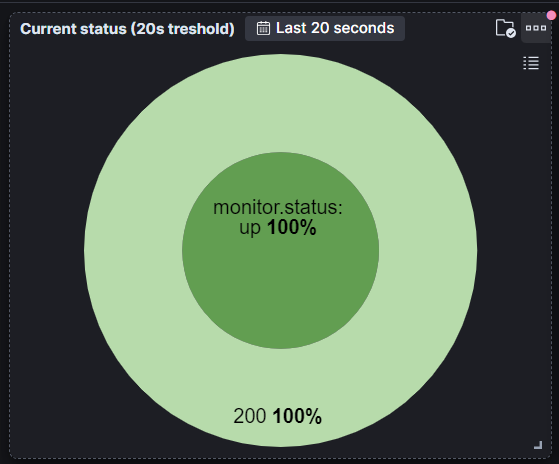

# ELK Controlroom Integration Project



## Used/interesting resources

-   [Official ELK docs](https://www.elastic.co/guide/index.html)
-   [RabbitMQ training course](https://training.cloudamqp.com/)
-   No code used but pretty interesting to read: [check them out](https://github.com/Jardelpz/events_savior?tab=readme-ov-file)
-   [Used repo 1](https://github.com/deviantony/docker-elk) setup script and also inspiration from reading their code base **FOLLOW THEIR [MIT LICENSE](https://github.com/deviantony/docker-elk/blob/main/LICENSE)!** or [BACKUP LINK](./MIT_LICENSE.txt)
-   [Used repo 2](https://github.com/elastic/uptime-contrib) dashboard resources used form their 7.x dashboard **FOLLOW THEIR [APACHE LICENSE](https://github.com/elastic/uptime-contrib/blob/master/LICENSE)!** or [BACKUP LINK](./APACHE_LICENSSE.txt)
-   [YTB NetworkChuck tutorial docker](https://www.youtube.com/watch?v=eGz9DS-aIeY)
-   [YTB NetworkChuck tutorial docker compose](https://www.youtube.com/watch?v=DM65_JyGxCo)
-   [YTB IBM message queue](https://www.youtube.com/watch?v=xErwDaOc-Gs)
-   [YTB IBM RabbitMQ](https://www.youtube.com/watch?v=7rkeORD4jSw)
-   [YTB ELK tutorial 1 part 1](https://www.youtube.com/watch?v=MB94whqmSKI) & [YTB ELK guide 1 part 2](https://www.youtube.com/watch?v=JcGIFmkg1bE)
-   [YTB ELK tutorial 2 (french)](https://www.youtube.com/watch?v=S5MyeD8ysxA)
-   [Heartbeat installation configuration](https://www.elastic.co/guide/en/beats/heartbeat/current/heartbeat-installation-configuration.html)

## Tech stack

-   Docker
-   ELK (elasticsearch, logstash, kibana)
-   Heartbeat (http monitoring for redundancy + may help with debugging)
-   Python
-   RabbitMQ (WIP)

## Setup

Go into the `./src` folder:

```bash
cd src
```

Create a `.env` file based on the `.env.example` file inside the `./src` folder and **fill in the required fields**.

```bash
cp ./.env.example ./.env
```

To start ELK for the first time run (keep in mind the reverse proxy should be in the same network (you could create a new one and add kibana to it) (if you use one, port 5601 is used for the web interface by default, feel free to unassign it inside `./src/docker-compose.yml` if you use a reverse proxy)):

```bash
docker compose up setup
```

**Note** that this should be run only once.

If an error occurs due to the network, try running this instead:

```bash
docker compose up setup --force-recreate
```

After the setup is done, you can run the ELK stack with (for the second time you will only need to run this command):

```bash
docker compose up -d
```

## Troubleshooting

You may need to run the following to fix some permission issues depending on your platform (in the home folder, not src folder):

```bash
chmod +rwx ./src/setup/entrypoint.sh
chmod go-w ./ELK/heartbeat/heartbeat.yml
chmod -R go-w ./ELK/heartbeat/services/
chmod -R 777 ./ELK/elasticsearch/data/
```

**Note** the last chmod recursively adds all permissions to everyone. If this is set on a real server with untrusted users, please change this to only give the required permissions.

## Adding services to monitor

### Heartbeat monitoring

If you'd like to add a service to monitor, please follow these steps:

Considering you're still in the `./src` folder, run:

```bash
cd ../ELK/heartbeat/services
```

Create a `service.yml.unconfirmed` file based on the `template.yml.unconfirmed` file inside the `./ELK/heartbeat/services` folder.

```bash
cp ./template.yml.unconfirmed ./service.yml.unconfirmed
```

Once filled in correctly, modify the name accordingly (modify `service` to the actual name of the service):

```bash
mv ./service.yml.unconfirmed ./service.yml
```

**Notes**

-   We check for new yml files every 5s, consider it may take up to 10s (with both the dashboard and the service set to reload every second) before showing up.
-   While a yml file isn't configured properly, we recommend to keep the `.unconfirmed` extension.
-   If you temporarely don't want to monitor a service you can set `enabled: false` in the yml file.

## Tests:

### docker-compose test

In case you'd like to verify the integrity of the `docker-compose.yml` file, follow the steps below.

If you've never done a docker-compose test, please execute the following command first:

```bash
sudo apt install docker-compose
```
**Note** your packet manager may differ. 

Once docker-compose is installed, please run the following command. If the file is good to go, it should return "OK". Else, it'll return "ERROR":

```bash
docker-compose config --quiet && printf "OK\n" || printf "ERROR\n"
```

### yaml validation

First off, make sure the project is running. If it isn't running, please do so [here](README.md#Setup).

Secondly, you'll need to enter the container. To do so, there's a few steps to follow.

Get the required information of the container with the following command:

```bash
sudo docker container ls | grep heartbeat
```

Now, look for the container running heartbeat. Use the ID for the following command:

```bash
sudo docker exec -it <id> bash
```

Inside the container, you can validate the content of the yaml file with the commands written below.

To validate the content of the yaml, enter the following command:

```bash
./heartbeat test config -c ./heartbeat.yml --path.data ~/data/ --path.home ~ 
```

If there are any errors and you'd like to see a more detailed explanation of what's good and wrong, use this command:

```bash
./heartbeat test output -c ./heartbeat.yml --path.data ~/data/ --path.home ~
```

Once finished, exit the container with the following command:

```bash
exit
```

## Website tips:

### Periodic refresh of the dashboard:

You can set the refresh rate of the dashboard in the top right corner of the dashboard like this:


Like this you'll have a real-time overview. This way you can drink your coffee rather than spamming the refresh-key and be alerted the moment something goes wrong.

### Enable dark mode:

Click on your profile picture in the top right corner:


Then click on `Edit profile`:


Then select `Dark`:


And click on `Save changes`:


And finally reload the page:


### Dashboard notes:

The `current status` has a default threshold of 20s, which means that, if a services in the last 20s has both been up and down, it will be counted as both. The 'donut' in kibana sadly doesn't allow us to pick the last status.


`Services` will always show the last status per ip & service during the monitoring time (see [this](README.md#Periodic-refresh-of-the-dashboard), you can also set a custom time range inside the panel settings), this means if a services changes ip during the monitoring time it will show up as two different services and you will always see the last status measured of each ip. To see this in action, you can try monitoring google.com as it constantly changes ip's.


The `accumulative uptime` counts all recorded uptimes and downtimes and calculates the uptime percentage based on it. This means that, if during 20% of the monitoring time 50% of the services were down, the downtime will be 10% (50% of 20%) and the uptime will be 90% (100% - 10%).


The `uptime graph` depicts the percentage of services that were up during a specific time frame. This graph will automatically adjust itself according to the interval selected at the top on the right.


<!-- deprecate as we have set the volume in the repo
Then you need to import `export.ndjson` into `Saved Objects` and you should see the dashboard appear in kibana. (If we add the volumes into the repo this will not be needed anymore) -->

<!-- old version:
to setup ELK: Setup keys via:
docker exec -it <elastic_id> bash
cd bin
elasticsearch-create-enrollment-token --scope kibana
copy paste the token into the webui

docker exec -it <kibana_id> bash
cd bin
./kibana-verification-code
copy paste the verification code into the webui -->
