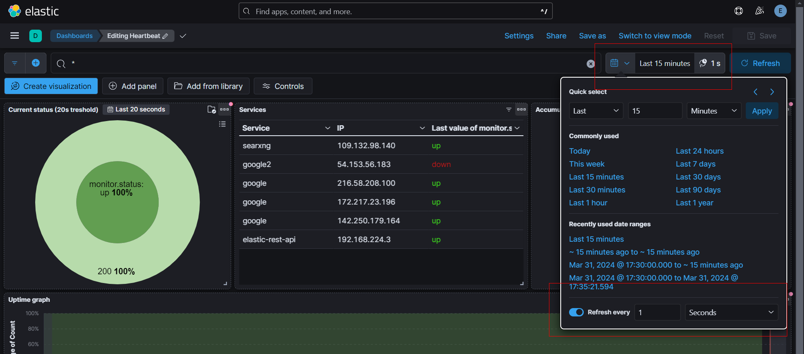
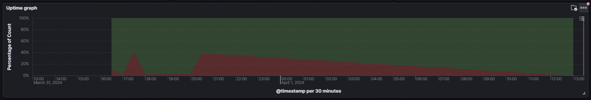
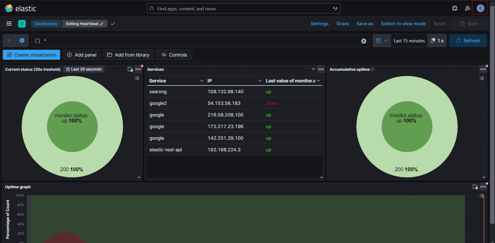
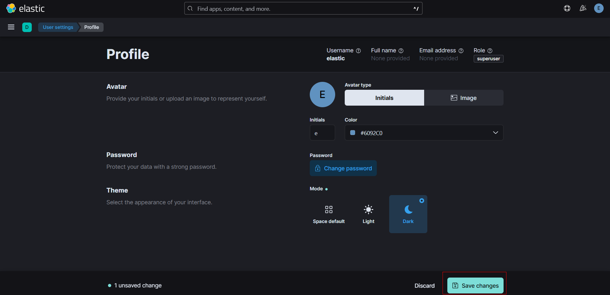
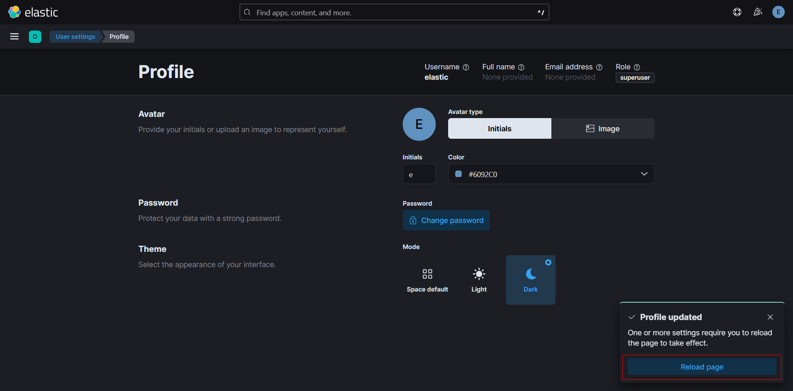

# Website tips:

## Periodic refresh of the dashboard:

You can set the refresh rate of the dashboard in the top right corner of the dashboard like this:

Like this you'll have a real-time overview. This way you can drink your coffee rather than spamming the refresh-key and be alerted the moment something goes wrong.

## Dashboard notes:

The `current status` has a default threshold of 20s, which means that, if a services in the last 20s has both been up and down, it will be counted as both. The 'donut' in kibana sadly doesn't allow us to pick the last status.

`Services` will always show the last status per ip & service during the monitoring time (see [this](website_utils.md#Periodic-refresh-of-the-dashboard), you can also set a custom time range inside the panel settings), this means if a services changes ip during the monitoring time it will show up as two different services and you will always see the last status measured of each ip. To see this in action, you can try monitoring google.com as it constantly changes ip's.

The `accumulative uptime` counts all recorded uptimes and downtimes and calculates the uptime percentage based on it. This means that, if during 20% of the monitoring time 50% of the services were down, the downtime will be 10% (50% of 20%) and the uptime will be 90% (100% - 10%).

The `uptime graph` depicts the percentage of services that were up during a specific time frame. This graph will automatically adjust itself according to the interval selected at the top on the right.

## Enable dark mode:

Click on your profile picture in the top right corner:

Then click on `Edit profile`:

Then select `Dark`:

And click on `Save changes`:

And finally reload the page:

<!-- deprecate as we have set the volume in the repo
Then you need to import `export.ndjson` into `Saved Objects` and you should see the dashboard appear in kibana. (If we add the volumes into the repo this will not be needed anymore) -->